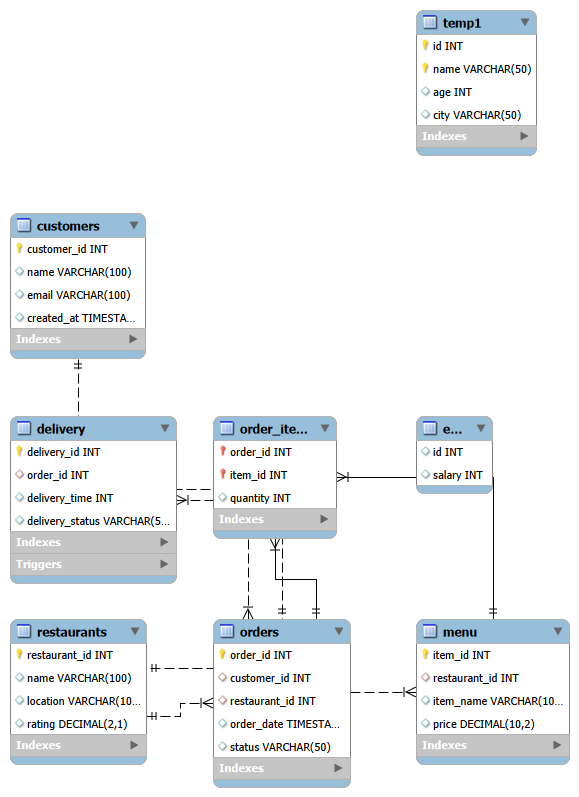

🍔 Food Delivery Database System (MySQL)

📌 Description

This project is a relational database system that simulates a food delivery platform similar to Zomato/Swiggy. It manages customers, restaurants, menu items, orders, and delivery details.

---

🧱 Features

- Customer and restaurant management
- Menu system for each restaurant
- Order placement and tracking
- Delivery management system
- Order status updates

---

🗂️ Database Structure

🔹 Tables:

- customers → stores customer details
- restaurants → stores restaurant information
- menu → stores food items and prices
- orders → stores order details
- order_items → stores items in each order
- delivery → stores delivery information

---

🔗 Relationships

- One customer can place multiple orders
- One restaurant can have multiple menu items
- One order can contain multiple items
- Each order has one delivery record

---

⚡ Advanced Features

- ✅ Trigger to automatically update order status after delivery
- ✅ Constraints to ensure valid data (quantity > 0)
- ✅ Indexing for faster query performance
- ✅ Complex JOIN queries for analytics

---

📊 Sample Queries

- Get all orders with customer and restaurant details
- Calculate total revenue per restaurant
- Find top restaurants based on number of orders
- Calculate average delivery time

---

🚀 How to Run

1. Import "schema.sql"
2. Run "data.sql"
3. Execute queries from "queries.sql"
4. Run advanced features from "advanced.sql"

---

🧩 ER Diagram

---

📈 Future Improvements

- Add payment system
- Implement discount and offers
- Add real-time order tracking
- Integrate with frontend (web application)

---

👨‍💻 Author
Khushi Jaiswal
